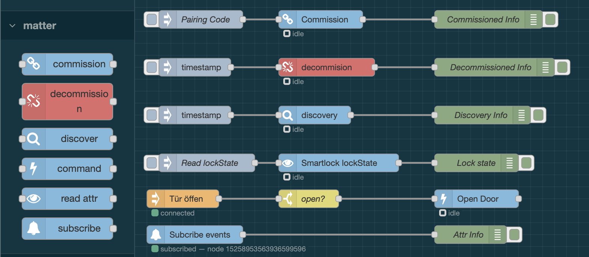

# node-red-contrib-matter

[](https://www.npmjs.com/package/@minguyen68/node-red-contrib-matter)
[](https://www.npmjs.com/package/@minguyen68/node-red-contrib-matter)
[](https://github.com/minhtuannguyen/node-red-contrib-matter)



A generic [Matter](https://csa-iot.org/all-solutions/matter/) protocol controller for [Node-RED](https://nodered.org/).  
Commission and control **any Matter device** — smart locks, lights, sensors — directly from Node-RED flows over IP or Thread.

Built on [matter.js](https://github.com/project-chip/matter.js) (`@project-chip/matter.js`).

---

## Features

- **Commission** any Matter device into your own fabric (multi-admin alongside Apple Home, Google Home, etc.)
- **Device registry** — after commissioning, devices are auto-discovered and stored; all other nodes show a **device dropdown** instead of requiring manual ID entry
- **Send commands** to any cluster and endpoint (lock/unlock, on/off, scenes, …)
- **Read attributes** on demand (lock state, brightness, temperature, …)
- **Subscribe** to real-time attribute changes and events
- **Decommission** devices cleanly from the fabric, or force-remove when offline
- Works on **Raspberry Pi** (Ethernet or WiFi) and any Node.js-capable Linux/macOS host
- Thread devices reachable via a Thread Border Router (HomePod, Apple TV, OTBR)

---

## Prerequisites

| Requirement | Version |
|---|---|
| Node.js | ≥ 20.0.0 |
| Node-RED | ≥ 3.0.0 |

---

## Installation

### From npm

```bash
cd ~/.node-red
npm install @minguyen68/node-red-contrib-matter
```

### From GitHub

```bash
cd ~/.node-red
npm install github:minhtuannguyen/node-red-contrib-matter
```

### From a local clone

```bash
git clone https://github.com/minhtuannguyen/node-red-contrib-matter.git
cd ~/.node-red
npm install ../node-red-contrib-matter
```

> **Note:** The compiled `dist/` folder is included in the repository, so no TypeScript compiler is needed on the target machine.

Then restart Node-RED:

```bash
node-red-restart
# or
sudo systemctl restart nodered
```

---

## Nodes

### `matter-controller` (config node)

Shared configuration node. Manages the Matter controller lifecycle — one per Node-RED instance.

| Property | Description | Default |
|---|---|---|
| Storage Path | Directory where fabric credentials and device registry are persisted | `~/.node-red-matter` |
| UDP Port | Matter controller port | `5540` |
| Log Level | matter.js log verbosity | `Info` |

The controller also serves an internal HTTP endpoint (`GET /matter-nodes/:id/registry`) used by the edit dialogs of all other nodes to populate their device dropdowns. This requires the controller node to be **deployed** before opening any other node's edit dialog.

---

### `matter-commission`

Commission a Matter device into the Node-RED controller fabric.

After successful commissioning the device is **automatically registered** in the device registry so it immediately appears in the dropdowns of the command, read, subscribe, and decommission nodes.

**Input `msg.payload`:**

| Field | Type | Description |
|---|---|---|
| `pairingCode` | string | 11-digit manual pairing code (hyphens optional). Overrides node config. |
| `knownAddress` | string | *(optional)* IPv6/IPv4 address to skip mDNS discovery. Useful for Thread devices. |

**Output `msg.payload`:**

```json
{ "nodeId": "<commissioned-node-id>", "endpoints": [...] }
```

> Before commissioning, open a commissioning window from your primary controller:  
> **Apple Home** → device → ⚙️ → *Turn on Pairing Mode*

---

### `matter-discover`

Discovers all endpoints, clusters, attributes, commands, and events of a commissioned device and **saves the result to the device registry**. Run this node once after commissioning (or any time you want to refresh the registry) so the dropdowns in the other nodes reflect the device's current structure.

**Input:** any message (triggers the discovery).  
Override `nodeId` at runtime via `msg.nodeId`.

**Output `msg.payload`:**

```json
{
  "nodeId": "<commissioned-node-id>",
  "endpoints": [
    {
      "endpointId": 0,
      "clusters": [
        {
          "clusterId": 40,
          "clusterIdHex": "0028",
          "clusterName": "BasicInformation",
          "attributes": ["vendorName", "productName", "serialNumber", ...],
          "commands": [],
          "events": []
        }
      ]
    },
    {
      "endpointId": 1,
      "clusters": [
        {
          "clusterId": 257,
          "clusterIdHex": "0101",
          "clusterName": "DoorLock",
          "attributes": ["lockState", "lockType", "doorState", ...],
          "commands": ["lockDoor", "unlockDoor", "unlockWithTimeout", ...],
          "events": ["doorLockAlarm", "lockOperation", ...]
        }
      ]
    }
  ]
}
```

Connect the output to a Debug node set to **"complete msg object"** to inspect the full structure.

> **Tip:** If the device dropdown in another node shows *"select a controller first"* or is empty after commissioning, run this node with the device's `nodeId`, then re-open the edit dialog.

---

### `matter-command`

Send a command to a cluster on a commissioned device.

The edit dialog shows **cascading dropdowns** (Device → Endpoint → Cluster → Command) populated from the device registry. The selected values fill the underlying text fields; all fields can also be overridden at runtime via `msg`:

| Field | Description | Example |
|---|---|---|
| `nodeId` | Commissioned node ID | `7825526669137635300` |
| `endpointId` | Endpoint number | `1` |
| `clusterId` | Cluster ID (hex) | `0101` (DoorLock) |
| `commandName` | Command name (camelCase) | `lockDoor`, `unlockDoor` |
| `payload` | Command arguments object | `{ "timeout": 30 }` |

---

### `matter-read`

Read an attribute value from a commissioned device on any input message.

The edit dialog shows **cascading dropdowns** (Device → Endpoint → Cluster → Attribute).

| Field | Description | Example |
|---|---|---|
| `nodeId` | Commissioned node ID | `7825526669137635300` |
| `endpointId` | Endpoint number | `1` |
| `clusterId` | Cluster ID (hex) | `0101` |
| `attributeName` | Attribute name (camelCase) | `lockState` |

**Output `msg.payload`:** the raw attribute value.

---

### `matter-subscribe`

Subscribes to real-time attribute changes and/or events from a device. Starts automatically on deploy, no input needed.

The edit dialog shows **cascading dropdowns** (Device → Endpoint → Cluster → Attribute / Event). All filter fields are optional — leave blank to receive everything from the device.

| Field | Description | Example |
|---|---|---|
| `nodeId` | Commissioned node ID (required) | `7825526669137635300` |
| `endpointId` | *(optional)* Filter by endpoint | `1` |
| `clusterId` | *(optional)* Filter by cluster (hex) | `0101` |
| `attributeName` | *(optional)* Filter by attribute | `lockState` |
| `eventName` | *(optional)* Filter by event | `doorLockAlarm` |

**Output `msg.payload` — attribute change:**
```json
{
  "type": "attribute",
  "nodeId": "7825526669137635300",
  "endpointId": 1,
  "clusterId": 257,
  "attributeName": "lockState",
  "value": 1,
  "timestamp": "2026-05-01T17:00:00.000Z"
}
```

**Output `msg.payload` — event:**
```json
{
  "type": "event",
  "nodeId": "7825526669137635300",
  "endpointId": 1,
  "clusterId": 257,
  "eventName": "doorLockAlarm",
  "events": [...],
  "timestamp": "2026-05-01T17:00:00.000Z"
}
```

---

### `matter-decommission`

Decommission (unpair) a Matter device from the controller fabric and remove it from the device registry.

The edit dialog shows a **Device dropdown** populated from the registry and a **Force** checkbox.

**Input `msg.payload`:**

| Field | Type | Description |
|---|---|---|
| `nodeId` | string | Decimal node ID of the device to remove. Overrides node config. |
| `force` | boolean | When `true`, skips the fabric-level RemoveFabric command and only erases local storage. Use when the device is offline or already factory-reset. Default: `false`. |

**Output `msg.payload`:**
```json
{ "ok": true, "nodeId": "7825526669137635300", "force": false }
```

| Mode | Behaviour |
|---|---|
| Normal (force = false) | Sends *RemoveFabric* to the device, then erases local storage and registry entry |
| Force (force = true) | Erases local storage and registry entry only — device must be manually factory-reset |

---

## Device Registry

The device registry is the central store that connects the `matter-commission` node to all other nodes. Instead of manually typing node IDs, cluster IDs, and attribute names, every node's edit dialog loads the registry and shows human-readable **cascading dropdowns**.

### How it works

```
commission → [auto-discover in background] → registry.json
                                                  ↓
                    command / read / subscribe / decommission / discover
                    edit dialogs load registry → device dropdown
```

1. **Commission** a device with `matter-commission`. Immediately after the pairing handshake completes, the node triggers a background discovery that writes the device's label, node ID, and full cluster/attribute/command structure to the registry.
2. **Open any other node's edit dialog**. The dialog fetches the registry from the controller's HTTP endpoint and populates a **Device** dropdown. Selecting a device pre-fills the node ID. Nodes that need more detail (command, read, subscribe) show further cascading dropdowns: Endpoint → Cluster → Attribute / Command / Event.
3. **Refresh the registry** at any time by triggering a `matter-discover` node. This is useful if the background discovery after commissioning was slow (e.g. the device rebooted after joining the fabric) or if the device firmware updated and exposed new clusters.
4. **Decommission** with `matter-decommission` — this removes the device from both the Matter fabric and the registry.

### Registry file

Persisted at `<storagePath>/node-red-matter/registry.json`  
Default: `~/.node-red-matter/node-red-matter/registry.json`

```json
{
  "7825526669137635300": {
    "label": "Nuki Smart Lock",
    "nodeId": "7825526669137635300",
    "discoveredAt": "2026-05-01T12:00:00.000Z",
    "discovery": {
      "nodeId": "7825526669137635300",
      "endpoints": [
        {
          "endpointId": 1,
          "clusters": [
            {
              "clusterId": 257,
              "clusterIdHex": "0101",
              "clusterName": "DoorLock",
              "attributes": ["lockState", "lockType", ...],
              "commands": ["lockDoor", "unlockDoor", ...],
              "events": ["doorLockAlarm", "lockOperation", ...]
            }
          ]
        }
      ]
    }
  }
}
```

### Registry lifecycle

| Event | Registry change |
|---|---|
| `matter-commission` completes | Entry added (background discovery, may take a few seconds) |
| `matter-discover` is triggered | Entry updated with latest cluster structure |
| `matter-decommission` runs | Entry removed |
| Node-RED restart | Registry loaded from disk — no re-discovery needed |

### Troubleshooting the dropdowns

- **"select a controller first"** — no controller is selected or the controller config node is not deployed yet.
- **"deploy the flow first, then re-open this dialog"** — the controller node has not been deployed. Click **Deploy** then re-open the edit dialog.
- **Device not in dropdown after commissioning** — the background discovery may still be in progress (the device reboots after joining the fabric). Wait 10–15 seconds, then trigger `matter-discover` with `msg.nodeId` set to the commissioned node ID, and re-open the dialog.
- **Dropdown shows a device but no endpoints** — the registry entry has no `discovery` data yet. Run `matter-discover` to populate it.

---

## Example: Nuki Smart Lock

Import `examples/nuki-lock.json` into Node-RED for a ready-made flow covering:

1. Commission the lock (one-time)
2. Discover and register in the device registry
3. Lock / Unlock / Unlock with timeout
4. Read `lockState` on demand
5. Subscribe to `lockState` changes and `doorLockAlarm` events

**DoorLock cluster reference:**

| Property | Value |
|---|---|
| Cluster ID | `0101` |
| Endpoint | `1` |
| Commands | `lockDoor`, `unlockDoor`, `unlockWithTimeout` |
| `lockState` values | `0` = NotFullyLocked, `1` = Locked, `2` = Unlocked, `3` = Unlatched |

**Battery level (PowerSource cluster):**

| Property | Value |
|---|---|
| Cluster ID | `002F` |
| Endpoint | `1` |
| Attribute | `batPercentRemaining` |
| Raw value | 0–200 (divide by 2 for %) — e.g. `170` → 85% |
| `batChargeLevel` | `0` = OK, `1` = Warning, `2` = Critical |

Add a Function node after `matter-read` to convert the raw value:
```javascript
msg.payload = msg.payload / 2;  // e.g. 170 → 85
return msg;
```

---

## Thread devices (HomePod, Apple TV as Border Router)

If your device is Thread-only (e.g. Nuki Smart Lock connected via HomePod), standard mDNS commissioning discovery won't bridge from Thread to your WiFi/Ethernet network. Pass the device's IPv6 address directly:

```json
{
  "pairingCode": "1234-567-8901",
  "knownAddress": "fd00::1234"
}
```

Find the IPv6 address using `avahi-browse -rt _matterc._udp` (Linux) or `dns-sd -B _matterc._udp local` (macOS) while the commissioning window is open.

---

## Development

```bash
git clone https://github.com/minhtuannguyen/node-red-contrib-matter.git
cd node-red-contrib-matter
npm install
npm run build       # compile TypeScript → dist/
npm run dev         # watch mode
```

Install as a live symlink into Node-RED for development:

```bash
cd ~/.node-red/node_modules
ln -s /path/to/node-red-contrib-matter node-red-contrib-matter
```

---

## License

Apache 2.0

